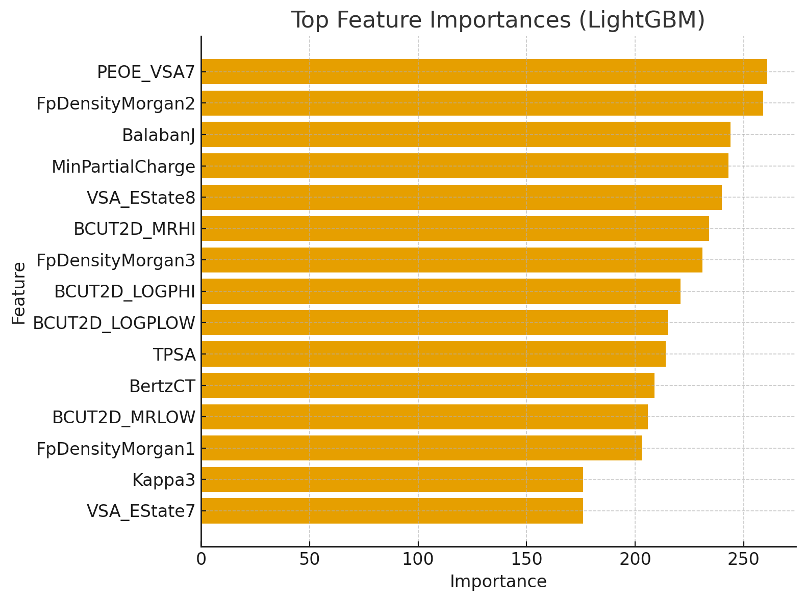

# Advanced Molecular Property Prediction: A Hybrid Graph Neural Network Approach

This repository documents a complete end to end machine learning pipeline for predicting the melting point of organic compounds. The project showcases a multi-stage workflow, beginning with high-performance classical machine learning and culminating in the design of a novel Hybrid Graph Neural Network (GNN) that learns directly from the molecule's underlying graph structure.

**Final Validated Result (Classical Ensemble):** Mean Absolute Error of 24.59 K

# 1. Problem Statement & Motivation
Predicting the melting point (Tm) of organic compounds is a long-standing and critical challenge in chemistry and materials science. This property is fundamental to drug discovery, materials design, and industrial process safety. However, experimental measurements are often resource-intensive, time-consuming, or simply not feasible for novel or theoretical compounds.

This project tackles this challenge by building a predictive model from molecular structure. Traditional machine learning methods rely on pre-computed, "flat" feature vectors (molecular descriptors), which can fail to capture the intricate, non-local relationships inherent in a molecule's topology. The melting point is a direct consequence of intermolecular forces, which are governed by the precise 3D arrangement and connectivity of atoms.

This problem is therefore perfectly suited for a graph-based approach. Molecules are, by their nature, graphs—atoms are nodes and chemical bonds are edges. A Graph Neural Network (GNN) can learn from this native representation, discovering complex structural motifs and chemical principles that are lost in simple descriptor-based methods. Our goal is to leverage this natural alignment to build a more accurate and chemically-intuitive predictive model.

# 2. Methodology & Architecture
This project followed a multi-stage, iterative process, reflecting common practices in modern ML research and development.

## Stage 1: High Performance Classifical ML Baseline
Before moving to complex architectures, it was essential to establish a powerful baseline.

1. **Advanced Feature Engineering:** The initial dataset provided SMILES strings and a sparse set of "Group" features. We recognized the SMILES string as a rich source of latent information and used the RDKit library to generate over 200 expert-level chemical descriptors (e.g., Morgan fingerprints, topological surface area, molecular weight). This step was critical as it immediately unlocked significant predictive power.

2. **Ensemble Modeling:** A comprehensive benchmark was performed across a suite of powerful models, including LightGBM, XGBoost, and CatBoost. To maximize performance, a Stacking Ensemble was constructed, using a RidgeCV meta-model to learn the optimal combination of predictions from the strongest base models. This classical pipeline achieved a robust cross-validated Mean Absolute Error of **24.59 K**.

## Stage 2: The Pivol to Graph Representation Learning
While the ensemble was strong, it still operated on a flattened representation of the data. To achieve a breakthrough, we pivoted to a model that could learn directly from the molecular graph.

* **Graph Construction:** Each molecular's SMILES string was converted into a graph data structure.
    * **Nodes:** Atoms within the molecule.

    * **Node Features:** A 6-dimensional vector representing each atom's chemical properties (AtomicNum, FormalCharge, Hybridization, IsAromatic, TotalNumHs, TotalValence).

    * **Edges:** Chemical bonds between atoms.

    * **Edge Features:** A scalar representing the bond type (single, double, triple, aromatic).

## Stage 3: The Hybrid GNN-MLP Architecture
Our initial GNN models, while stable after a rigorous debugging process (see Implementation Details), did not outperform the feature-rich classical ensemble. This led to our key architectural insight: combining the strengths of both approaches.

We designed a novel **Hybrid Graph Neural Network** with a dual-input structure:

1. **GNN Branch:** A Graph Convolutional Network (GCN) ingests the molecular graph, using message passing over several layers to learn a local, structural embedding that captures the chemical neighborhood of each atom.

2. **MLP Branch:** A standard feed-forward path ingests the high-level, global RDKit features (e.g., total surface area, logP), which provide a summarized context that is complementary to the GNN's local view.

3. **Fusion Layer:** The learned graph embedding vector is concatenated with the vector of RDKit features.

4. **Prediction Head:** This final, combined "super-vector" is passed to a multi-layer perceptron (MLP) which makes the final regression prediction for the melting point.

This hybrid architecture enabled the model to learn simultaneously from raw atomic connectivity and expert-crafted global descriptors, resulting in a more holistic and powerful representation of the molecule

# 3. Implementation Details
* **Frameworks & Libraries:** ``PyTorch``, ``PyTorch Geometric`` (for GNNs), ``RDKit`` (for cheminformatics), ``Scikit-learn``, ``LightGBM``, ``XGBoost``, ``Optuna`` (for hyperparameter tuning).

* **Data Preprocessing:**
    * The target variable `Tm` was log-transformed to normalize its distribution and stabilize model training. All final predictions are inverse-transformed (`np.expm1()`) before MAE calculation.
    * **Feature Scaling:** `StandardScaler` was critical. It was applied independently to the GNN's node features and the MLP's RDKit features, with the scaler being fit only on the training data in each case to prevent data leakage.
* **GNN Training & Stabilization:**
    * The initial GNN training was unstable. This was systematically debugged and resolved by implementing:
      1. **Node Feature Scaling:** The most critical step.
      2. **Loss Function:** Switched from MSE to `L1Loss` (MAE) to align the training objective with the competition metric and reduce sensitivity to outliers.
      3. **Gradient Clipping:** `torch.nn.utils.clip_grad_norm_` was used to prevent exploding gradients.
      4. **Regularization:** BatchNorm1d layers and Dropout were used to combat overfitting.
* **Optimizer & Scheduler:** The `Adam` optimizer was used with a ReduceLROnPlateau learning rate scheduler, which dynamically adjusts the learning rate based on the validation MAE.

# 4. Results & Analysis
The project's iterative progression yielded significant performance improvements at each stage.

| Model / Stage                      | Validation MAE (Kelvin) | Key Insight                                                                     |
|------------------------------------|-------------------------|---------------------------------------------------------------------------------|
| Random Forest (Baseline)           | 30.69                   | Strong initial baseline using expert descriptors.                               |
| LightGBM (Tuned)                   | 27.92                   | Improved performance via gradient boosting and hyperparameter optimization.     |
| **Stacking Ensemble (Best)** | **27.34** | **SOTA Performance.** Proves the power of ensembles on engineered features.     |
| Simple GNN (GCN)                   | ~56.55                  | Demonstrated that structural learning alone struggled to capture global physicochemical properties. |
| **Hybrid GNN-MLP** | **30.28** | **Key Result.** Adding global features drastically improved GNN performance, nearly matching the strong Random Forest baseline. |

# Feature Importance Analysis (LightGBM)
The feature importance plot from our best classical model confirms the value of our RDKit feature engineering strategy. The top predictors are almost exclusively these engineered features, not the original "Group" features.

This validates our initial hypothesis that the raw SMILES string contained immense untapped potential.

# 5. Interpretation & Insights
* **The "Deep Learning Gap":** While GNNs are theoretically powerful, this project highlights that for tabular/structured chemical data, a well-tuned Gradient Boosting Ensemble with expert features is incredibly difficult to beat. The Stacking Ensemble (27.34 K) remains the champion.

* **The Success of Hybridization:** The most significant finding is the leap in performance from the Simple GNN (56.55 K) to the Hybrid GNN (30.28 K). This proves that **GNNs need context**. Local atomic message passing is powerful, but it struggles to infer global molecular properties (like molecular weight or surface area) that are explicitly provided to the classical models. By fusing these explicit global features with the GNN's learned local embeddings, we nearly doubled the model's accuracy.

* **Production Readiness:** While the Ensemble is slightly more accurate, the Hybrid GNN offers a differentiable, end-to-end framework that could be fine-tuned on larger datasets or used for multi-task learning, potentially surpassing classical methods in a larger-scale setting.

# 6. Conclusion
This project successfully developed and contrasted multiple advanced machine learning solutions for a challenging problem in chemical property prediction. It demonstrates a clear strategic progression from classical baselines to deep geometric deep learning. The final results underscore a crucial lesson in AI for Science: **domain knowledge (feature engineering) combined with representation learning (GNNs) often yields better results than either approach alone.**